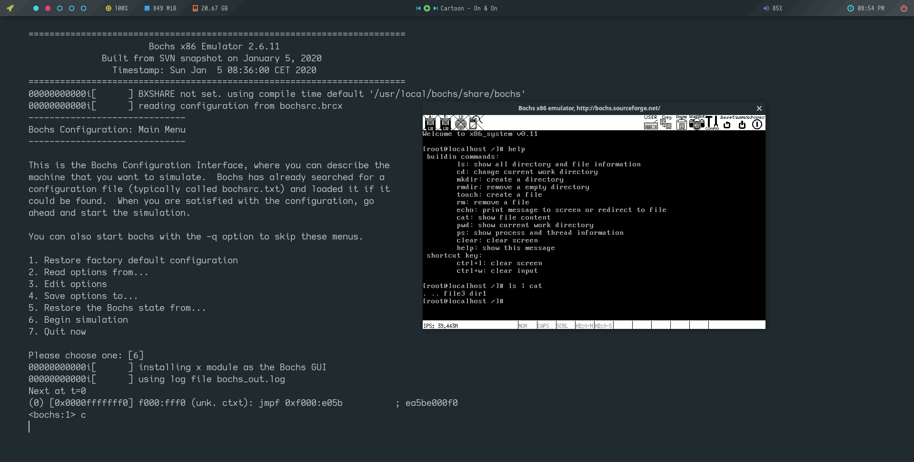

# 一个简单的x86内核



## 开发环境

* gcc (GCC) 11.1.0
* NASM version 2.15.05
* Bochs x86 Emulator 2.6.11


## 运行

首先进入项目目录构建系统镜像

```shell
make build
```

然后会在当前目录生成一个x86_system.img镜像文件，这就是系统盘，包含了bootloader和内核，他是没有文件系统的裸盘。

所以运行需要另外准备一张数据盘，可以使用bochs提供的 `bximage`  生成一张数据盘（直接执行，按照提示输入即可，注意选择hard disk不是floppy），然后使用 `fdisk` 或其他工具对他进行分区（**不需要创建文件系统**，系统启动的时候会扫描有没有文件系统，没有会自动创建）

之后准备好后配置项目目录下的bochsrc.brcx以下两行：

```
 25 ata0-master: type=disk, path="path of system disk", mode=flat, cylinders=121, heads=16, spt=63
 26 ata0-slave: type=disk, path="path of data disk", mode=flat, cylinders=162, heads=16, spt=63
```

把path改成你的数据盘和系统盘路径，master是系统盘，slave是数据盘。之后便可以运行：

```shell
bochs -f bochsrc.brcx
```

默认会挂在数据盘的第一个分区（sdb1），即第二块硬盘的第一个分区（第三个字母表示那块硬盘，b表示第二块硬盘，数字表示分区编号，主分区是1～4，扩展分区从5开始），可以在fs/fs.c文件中更改：

```c
1032     /* 确定默认挂载分区 */
1033     char default_part[8] = "sdb1";
```

